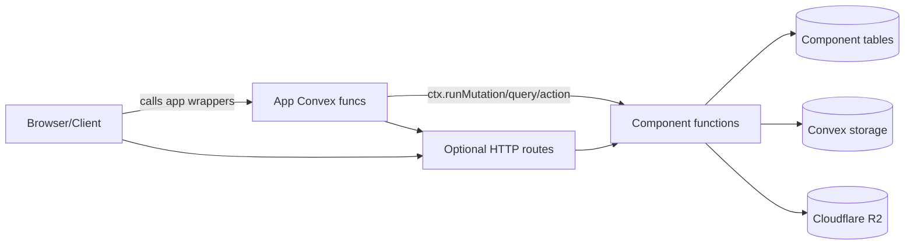
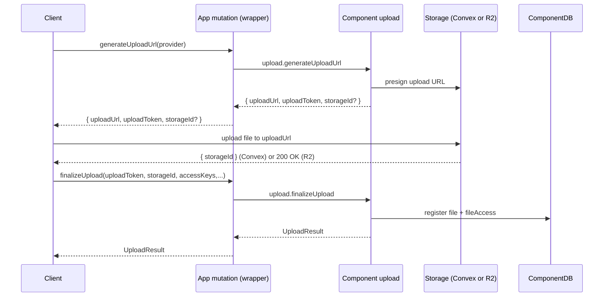
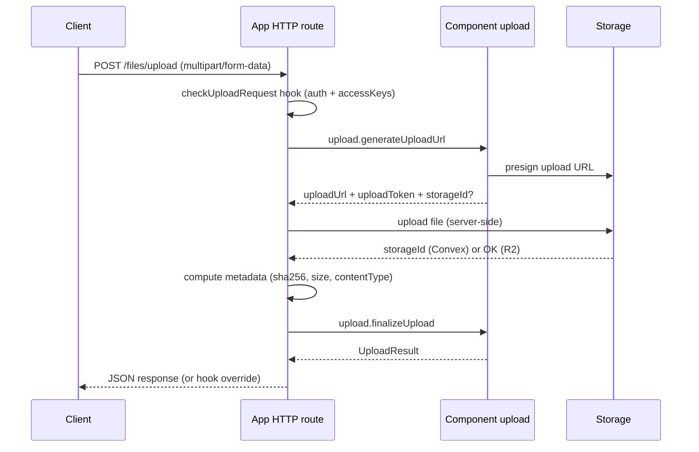
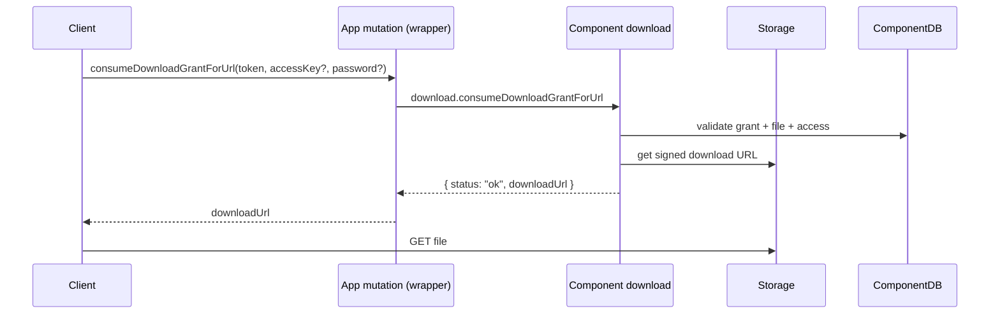
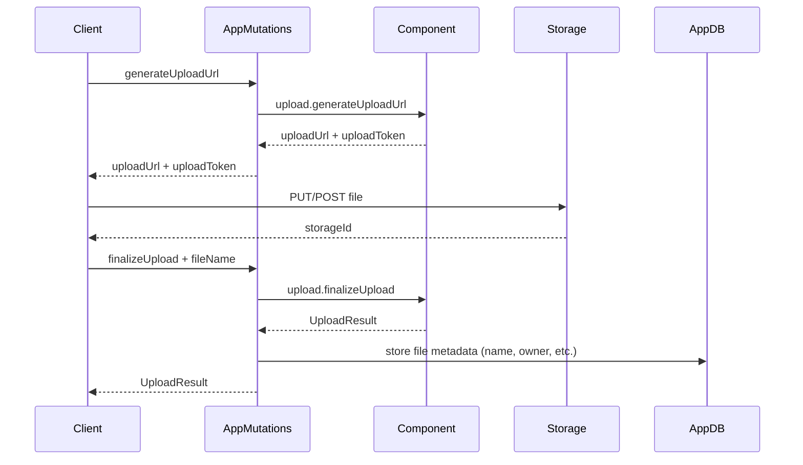
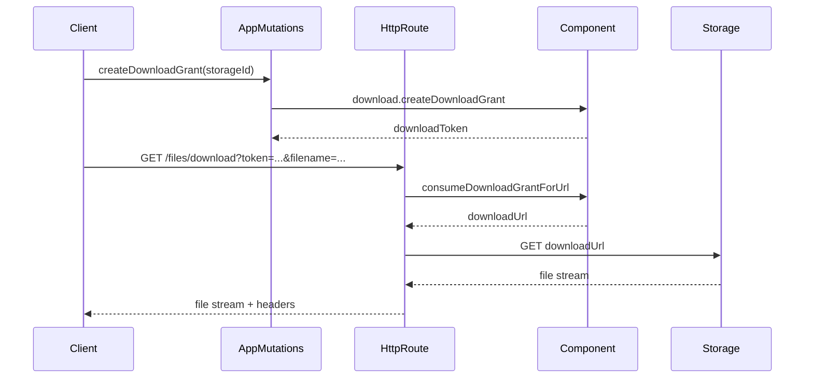
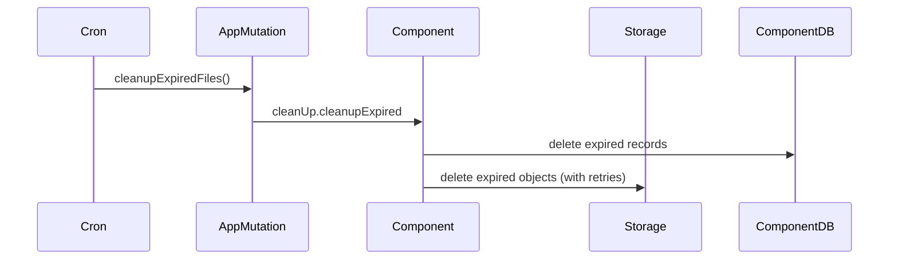

# Convex Files Control - LLM Guide

This document is written for LLMs and humans who need a deep, end-to-end
understanding of how this repository's Convex component, client helpers, and
React hook work. It is intentionally exhaustive.

================================================================================
SECTION 1 - CONVEX COMPONENTS PRIMER (WHAT, HOW TO MOUNT, LIMITATIONS)
================================================================================

## 1.1 What a Convex component is (conceptual model)

A Convex component is a self-contained, reusable bundle of:

- A Convex schema (its own tables and indexes).
- Convex functions (queries, mutations, actions, internal functions).
- A component configuration (`defineComponent`) that can depend on other
  components.

Key traits:

- Isolation: a component's tables live in its own namespace. Your application
  code does not directly read or write a component's tables.
- Public surface: you interact with a component by calling its functions via
  the component API.
- Reusability: a component can be published as a package and re-mounted in
  multiple apps.

In this repo, the component is "Convex Files Control". It exposes file upload,
access control, download grants, cleanup, and transfer utilities.

## 1.2 What "mounting" means

Mounting a component registers its schema and functions with your app. This
creates a typed component API that your app can call.

From this repo (usage shown in README, and exported in `package.json`):

```ts
// convex.config.ts (in your app)
import { defineApp } from "convex/server";
import convexFilesControl from "@gilhrpenner/convex-files-control/convex.config";

const app = defineApp();
app.use(convexFilesControl);

export default app;
```

Once mounted, Convex codegen generates a `components` namespace in your app's
`convex/_generated/api` so you can call:

```ts
ctx.runMutation(components.convexFilesControl.upload.generateUploadUrl, {...})
```

## 1.3 How component APIs are consumed

Important: component functions are not directly exposed to your client.
You call them from your app's Convex functions (queries/mutations/actions). This
provides a place to enforce auth and store your own metadata.

Example wrapper in your app:

```ts
import { mutation } from "./_generated/server";
import { components } from "./_generated/api";

export const generateUploadUrl = mutation({
  args: { provider: v.union(v.literal("convex"), v.literal("r2")) },
  handler: async (ctx, args) => {
    // Auth + business rules live here
    return ctx.runMutation(
      components.convexFilesControl.upload.generateUploadUrl,
      { provider: args.provider },
    );
  },
});
```

## 1.4 Component boundaries and limitations (general + this repo)

General Convex component behavior:

- A component has its own schema and tables. Your app cannot query those
  tables directly; you must use the component's functions.
- Components are not automatically part of your public API. To expose them to
  a client, you must create wrapper functions in your app.
- The component cannot store or enforce your app's domain data unless you
  explicitly pass it via wrapper functions or hooks.

Repo-specific limitations and design choices:

- This component stores only storage IDs, providers, ACLs, and download
  grants. It does not store your business metadata (file names, owners, etc.).
  You must store those in your own app tables.
- Access control is enforced by access keys. The component does not verify
  who the access key belongs to; your app does.
- Virtual paths (if you use them) are globally unique within the component.
  Multi-tenant apps should namespace paths at the app layer (e.g.,
  `/tenant/<id>/...`).
- The component supports Convex storage and Cloudflare R2 only.
- File transfer and metadata computation may download the full file into
  memory (important for very large files).
- Cleanup is not automatic; you should schedule it (e.g., with cron jobs).

## 1.5 Runtime and usage expectations

- Convex functions must run in the Convex runtime.
- Actions that touch external services (R2, fetch) are implemented as actions.
- The React hook is client-side only and expects you to provide app-level
  wrapper mutations.
- The optional HTTP routes are registered by your app and live in your app's
  `convex/http.ts`.

================================================================================
SECTION 2 - CONVEX FILES CONTROL (DETAILED SYSTEM DOCUMENTATION)
================================================================================

This section is a comprehensive, implementation-level reference for the
component, client helpers, and React hook in this repository.

--------------------------------------------------------------------------------
2.1 High-level overview
--------------------------------------------------------------------------------

Convex Files Control provides:

- Two-step uploads via presigned URLs (Convex storage or R2).
- Optional HTTP upload/download endpoints that can be protected by your auth
  hooks.
- Access keys to authorize file reads without exposing user IDs.
- Download grants with expiration, max uses, and optional passwords.
- Cleanup utilities for expired uploads, grants, and files.
- Transfer utilities between Convex storage and R2.
- A React hook to simplify presigned or HTTP uploads.

The component and its helpers are built in three layers:

1. Component layer (`src/component/`): schema + Convex functions.
2. Server/client helpers (`src/client/`): HTTP routes, FilesControl class, URL
   builders, type helpers.
3. React hook (`src/react/`): `useUploadFile`.

--------------------------------------------------------------------------------
2.2 File map (what lives where)
--------------------------------------------------------------------------------

Component (core behavior, schema, functions):

- `src/component/convex.config.ts`: defines the component and uses the action
  retrier component.
- `src/component/schema.ts`: component tables + indexes.
- `src/component/upload.ts`: presigned URL flow, file registration, R2 metadata.
- `src/component/download.ts`: download grants + consumption.
- `src/component/accessControl.ts`: access key management and expiration.
- `src/component/queries.ts`: paginated list and access queries.
- `src/component/cleanUp.ts`: delete and cleanup logic + scheduled follow-ups.
- `src/component/transfer.ts`: move files between providers.
- `src/component/lib.ts`: shared helpers (access key normalization, password
  hashing, and storage lookups).
- `src/component/validators.ts`: reusable validators + summary mapping helpers.
- `src/component/storageProvider.ts`: provider validator and types.
- `src/component/constants.ts`: TTLs and defaults.
- `src/component/r2.ts`: R2 client, presigned URL helpers, delete.

Client/server helpers:

- `src/client/index.ts`: `registerRoutes`, `buildDownloadUrl`, `FilesControl`,
  typed hooks for app-level API generation.
- `src/client/http.ts`: CORS, JSON responses, filename sanitization.

React hook:

- `src/react/index.ts`: `useUploadFile` hook for presigned or HTTP uploads.

Shared:

- `src/shared/*`: shared types and URL helpers across component, client, React.

Testing helper:

- `src/test.ts`: `register` helper for `convex-test`.

--------------------------------------------------------------------------------
2.3 Architecture diagram
--------------------------------------------------------------------------------



--------------------------------------------------------------------------------
2.4 Core data model
--------------------------------------------------------------------------------

Schema lives in `src/component/schema.ts`.

### Tables

1) `files`
- `storageId: string` (primary identifier for the storage object)
- `storageProvider: "convex" | "r2"`
- `expiresAt?: number`
- `virtualPath?: string`
- Indexes:
  - `by_storageId`
  - `by_virtualPath`
  - `by_expiresAt`

2) `fileAccess`
- `fileId: Id<"files">`
- `storageId: string`
- `accessKey: string`
- Indexes:
  - `by_fileId`
  - `by_storageId`
  - `by_accessKey_and_storageId`

3) `downloadGrants`
- `storageId: string`
- `expiresAt?: number`
- `maxUses: number | null`
- `useCount: number`
- `shareableLink?: boolean`
- password fields (optional):
  - `passwordHash`
  - `passwordSalt`
  - `passwordIterations`
  - `passwordAlgorithm`
- Indexes:
  - `by_storageId`
  - `by_expiresAt`

4) `pendingUploads`
- `expiresAt: number`
- `storageProvider: "convex" | "r2"`
- `storageId?: string` (pre-generated for R2)
- `virtualPath?: string`
- Index:
  - `by_expiresAt`

### Why this model exists

- `files` is the canonical component record for a file.
- `fileAccess` is an ACL mapping from access keys to files.
- `downloadGrants` is a short-lived, optionally password-protected token for
  downloads.
- `pendingUploads` enforces a two-step upload flow with a TTL.

--------------------------------------------------------------------------------
2.5 Core concepts and terminology
--------------------------------------------------------------------------------

- storageId: Provider-specific identifier for the stored object. For Convex
  storage it is the Convex storage ID; for R2 it is a UUID key.
- storageProvider: "convex" or "r2".
- accessKey: An arbitrary string representing a user, tenant, or group. Used
  for access control. It is normalized (trim + non-empty).
- virtualPath: Optional logical path for a file (e.g., `/tenant/123/avatar.png`).
  This is a metadata-only path for Convex storage and can be used as the real
  object key for R2. Paths are globally unique within the component.
- downloadGrant: A short-lived token that grants download access under
  configured constraints (max uses, expiration, optional password).
- pendingUpload: A token created at upload initiation, ensuring the file is
  registered only if it corresponds to a recent upload.

--------------------------------------------------------------------------------
2.6 Upload flows (presigned URL + HTTP)
--------------------------------------------------------------------------------

### 2.6.1 Presigned upload flow (client + app wrapper + component)



Key details from implementation (`src/component/upload.ts`):

- `generateUploadUrl`:
  - Creates a `pendingUploads` record with TTL = 1 hour
    (`PENDING_UPLOAD_TTL_MS`).
  - For Convex provider: uses `ctx.storage.generateUploadUrl()`.
  - For R2 provider: uses `virtualPath` as the object key when provided;
    otherwise generates a UUID storageId and presigned PUT URL.
  - Stores `virtualPath` on the pending upload if supplied.
- `finalizeUpload`:
  - Validates the pending upload exists and is not expired.
  - Validates storageId matches the pending upload if preset (R2).
  - Applies `virtualPath` from the finalize call or pending upload record.
  - Calls `registerFileCore`, then deletes the pendingUpload record.
- `registerFileCore`:
  - Requires at least one normalized access key.
  - Validates expiration is in the future (or null).
  - Rejects duplicate `virtualPath` values (global uniqueness).
  - For Convex: reads system storage metadata if not provided.
  - For R2: metadata must be provided or computed separately.

Note: To make R2 store the object at the virtual path, you must provide
`virtualPath` during upload URL generation (or via the HTTP upload route),
so the presigned URL uses that key. Supplying `virtualPath` only at
finalize time will store the path in metadata but keep the underlying R2 key
as whatever was used during upload.

### 2.6.2 HTTP upload route flow (optional)

HTTP upload is implemented in `src/client/index.ts` and must be registered by
your app with `registerRoutes`.



Important HTTP upload rules:

- Requires `checkUploadRequest` hook; otherwise `registerRoutes` throws.
- Accepts `multipart/form-data` with:
  - `file` (required)
  - `provider` (optional)
  - `expiresAt` (optional: timestamp or "null")
  - `virtualPath` (optional: trimmed non-empty string)
- Access keys are not accepted via the form. They must come from the
  `checkUploadRequest` hook.
- When provider is R2, server requires R2 config from env or options.
- Metadata is computed from the uploaded file (sha256, size, contentType).

--------------------------------------------------------------------------------
2.7 Download grants and download flow
--------------------------------------------------------------------------------

### 2.7.1 Create a download grant

`download.createDownloadGrant` creates a token stored in `downloadGrants`.

Behavior:

- Validates file exists and is not expired.
- Validates `maxUses` (> 0 or null) and expiration is in the future.
- Optional password is hashed with PBKDF2-SHA256 (120k iterations) and stored
  on the grant.
- `shareableLink` bypasses access key checks (unless overridden in HTTP route).

### 2.7.2 Consume a download grant

`download.consumeDownloadGrantForUrl` performs:

- Existence and expiration checks; deletes expired grants.
- `maxUses` check; deletes grant if exhausted.
- Access control:
  - If `shareableLink` is true: access key is not required.
  - Otherwise: requires a valid access key linked to the file.
- Optional password validation (PBKDF2 hash compare).
- File expiration check. If the file expired, it schedules a delete and returns
  `file_expired`.
- Returns a signed download URL (Convex storage URL or R2 signed GET URL).
- Updates `useCount` or deletes the grant if max uses reached.

### 2.7.3 Download flow diagram



### 2.7.4 HTTP download route behavior

The optional HTTP route (registered via `registerRoutes`) handles downloads.

- Route: `GET /<pathPrefix>/download?token=...&filename=...`
- Retrieves password from:
  - Header (default: `x-download-password`)
  - OR query param (default: `password`)
- Access key is provided by `checkDownloadRequest` hook.
- If `requireAccessKey` is true and hook does not supply one, request fails.
- Returns streamed file response with:
  - `Content-Disposition: attachment; filename="<sanitized>"`
  - `Cache-Control: no-store`
- Error status mapping:
  - 410 for expired/exhausted/file_expired
  - 401 for password required
  - 403 for access denied/invalid password
  - 404 for not found / generic failure

--------------------------------------------------------------------------------
2.8 Access control operations
--------------------------------------------------------------------------------

From `src/component/accessControl.ts`:

- `addAccessKey(storageId, accessKey)`
  - Normalizes the key (trim + non-empty).
  - Fails if file does not exist or key already exists.
- `removeAccessKey(storageId, accessKey)`
  - Fails if file not found or key not attached.
  - Cannot remove the last access key (protects against orphaned files).
- `updateFileExpiration(storageId, expiresAt)`
  - Allows setting or clearing expiration (null).
  - Validates the timestamp is in the future.

--------------------------------------------------------------------------------
2.9 Queries (read access)
--------------------------------------------------------------------------------

From `src/component/queries.ts`:

- `listFilesPage(paginationOpts)`
- `listFilesByAccessKeyPage(accessKey, paginationOpts)`
- `getFile({ storageId })`
- `getFileByVirtualPath({ virtualPath })`
- `listAccessKeysPage(storageId, paginationOpts)`
- `listDownloadGrantsPage(paginationOpts)`
- `hasAccessKey(storageId, accessKey)`

All list queries use cursor pagination via `convex-helpers`.

--------------------------------------------------------------------------------
2.10 Cleanup and lifecycle management
--------------------------------------------------------------------------------

From `src/component/cleanUp.ts`:

Key operations:

- `deleteFile(storageId)`:
  - Removes file record, access keys, download grants, and underlying storage.
- `cleanupExpired({ limit })`:
  - Deletes expired:
    - pending uploads
    - download grants
    - files (including storage object)
  - If more work remains, schedules internal cleanup to continue.

Deletion uses `@convex-dev/action-retrier` (when available) to retry storage
operations, especially for external providers (R2). In tests or dev, a fallback
path is used.

Recommendation: schedule cleanup with a cron job in your app.

--------------------------------------------------------------------------------
2.11 Transfers between providers
--------------------------------------------------------------------------------

From `src/component/transfer.ts`:

Goal: move a file between Convex storage and R2 while preserving ACLs and grants.

Transfer steps:

1. Fetch file record (internal query).
2. Verify provider change is necessary.
3. Create a signed source URL and `fetch` the file.
4. Upload to the target provider:
   - Convex: `ctx.storage.store(blob)`
   - R2: `PutObjectCommand` with `virtualPath` as the key when present,
     otherwise a new UUID key
5. Commit transfer:
   - Update file record storageId + provider.
   - If a new virtual path is provided, update it on the file record.
   - Update all access keys + grants to the new storageId.
   - Delete the original storage object (with retry).

Limitation: the transfer flow downloads the entire file into memory before
uploading, so it is not optimal for extremely large files.

--------------------------------------------------------------------------------
2.12 Password hashing and access key normalization
--------------------------------------------------------------------------------

From `src/component/lib.ts`:

- Access keys are normalized with `trim()`. Empty strings are rejected.
- Duplicate keys are removed.
- Passwords for download grants are hashed using:
  - PBKDF2-SHA256
  - 120,000 iterations
  - 16-byte salt
  - 32-byte derived key
- Password verification uses constant-time comparison.

--------------------------------------------------------------------------------
2.13 R2 integration specifics
--------------------------------------------------------------------------------

From `src/component/r2.ts` and `src/shared/r2.ts`:

- Uses AWS SDK S3 client pointed at Cloudflare R2 endpoints.
- Presigned URLs:
  - Upload: signed `PutObject`
  - Download: signed `GetObject`
- Delete: `DeleteObject`

R2 config required fields:

- `accountId`
- `accessKeyId`
- `secretAccessKey`
- `bucketName`

R2 config can be passed:

- Directly in component calls (`r2Config`), or
- Via env vars for HTTP routes and client helpers:
  - `R2_ACCOUNT_ID`
  - `R2_ACCESS_KEY_ID`
  - `R2_SECRET_ACCESS_KEY`
  - `R2_BUCKET_NAME`

--------------------------------------------------------------------------------
2.14 Client/server helper APIs
--------------------------------------------------------------------------------

### 2.14.1 `registerRoutes` (HTTP upload/download)

Signature and behavior are in `src/client/index.ts`.

Options:

- `pathPrefix` (default: `/files`)
- `enableUploadRoute` (default: false)
- `enableDownloadRoute` (default: true)
- `defaultUploadProvider` (default: "convex")
- `checkUploadRequest` (required if upload route enabled)
- `onUploadComplete` (optional)
- `checkDownloadRequest` (optional)
- `requireAccessKey` (default: false)
- `passwordHeader` (default: `x-download-password`)
- `passwordQueryParam` (default: `password`)
- `r2` (R2 config input or env-based)

### 2.14.2 `buildDownloadUrl`

Creates a URL for the HTTP download route:

```ts
buildDownloadUrl({
  baseUrl: "https://your-app.convex.site",
  downloadToken,
  filename: "report.pdf",
  pathPrefix: "/files",
});
```

### 2.14.3 `FilesControl` server helper

`FilesControl` wraps component calls and optionally resolves R2 config:

- `generateUploadUrl`
- `finalizeUpload`
- `registerFile`
- `createDownloadGrant`
- `consumeDownloadGrantForUrl`
- `addAccessKey`
- `removeAccessKey`
- `updateFileExpiration`
- `deleteFile`
- `cleanupExpired`
- `computeR2Metadata`
- `transferFile`
- `getFile`, `getFileByVirtualPath`, `listFilesPage`,
  `listFilesByAccessKeyPage`, `listAccessKeysPage`,
  `listDownloadGrantsPage`, `hasAccessKey`

It also exposes `clientApi()` which generates a ready-to-export API surface
with hooks for auth and side effects.

### 2.14.4 `FilesControlHooks` (hooked API generation)

Hooks you can pass to `clientApi()`:

- `checkUpload`, `checkFileMutation`, `checkAccessKeyMutation`
- `checkDownloadConsume`
- `checkMaintenance`
- `checkReadFile`, `checkReadAccessKey`, `checkListFiles`
- `checkReadVirtualPath`
- `checkListDownloadGrants`
- `onUpload`, `onDelete`, `onAccessKeyAdded`, `onAccessKeyRemoved`
- `onDownloadGrantCreated`, `onDownloadConsumed`, `onExpirationUpdated`

These hooks let you implement auth and auditing without writing boilerplate
wrappers for each component function.

--------------------------------------------------------------------------------
2.15 React hook: `useUploadFile`
--------------------------------------------------------------------------------

From `src/react/index.ts`:

Purpose: Upload files from React using either:

- `presigned` (default): client uploads directly to storage, then calls
  `finalizeUpload`.
- `http`: client uploads via HTTP route.

Usage pattern:

```tsx
import { useUploadFile } from "@gilhrpenner/convex-files-control/react";
import { api } from "../convex/_generated/api";

const { uploadFile } = useUploadFile(api.files, {
  method: "presigned",
  provider: "convex",
  http: { baseUrl: convexSiteUrl },
});

await uploadFile({ file });
```

Important details:

- The hook expects API references to your app wrappers, not component
  functions directly.
- For HTTP uploads, you must provide either:
  - `http.uploadUrl` or
  - `http.baseUrl` (+ optional `pathPrefix`).
- If you pass `authToken`, it sets an `Authorization: Bearer <token>` header
  on HTTP upload requests.

--------------------------------------------------------------------------------
2.16 Practical limitations, edge cases, and behavior
--------------------------------------------------------------------------------

1) Access keys
   - Must be non-empty (trimmed).
   - Duplicate access keys are deduplicated.
   - Last access key cannot be removed from a file.

2) Virtual paths
   - Optional and globally unique across the component.
   - Best practice: namespace by tenant/user in your app (e.g., `/tenant/<id>/...`).
   - Keep normalization simple (trim only); avoid `..` and ambiguous paths in app logic.
   - Uniqueness is enforced at write time but is not race-proof under concurrent uploads.

3) Upload tokens
   - Expire after 1 hour (`PENDING_UPLOAD_TTL_MS`).
   - Finalize fails if token missing or expired.

4) File expiration
   - `expiresAt` must be in the future.
   - If a file expires, download consumption schedules deletion and returns
     `file_expired`.

5) R2 metadata
   - For R2 uploads, metadata is not available from Convex system tables.
   - The HTTP route computes metadata by hashing the file.
   - `computeR2Metadata` downloads the entire object, which is expensive for
     large files.

6) Transfer size
   - Transfers buffer the entire file in memory.

7) Shareable links vs. access keys
   - If `shareableLink` is true, the component does not require access keys.
   - The HTTP route can override this with `requireAccessKey: true`.

8) Password handling
   - Passwords are hashed; only verification is supported.
   - Avoid passing passwords in query params; prefer headers.

--------------------------------------------------------------------------------
2.17 End-to-end diagrams for common flows
--------------------------------------------------------------------------------

### 2.17.1 Presigned upload with metadata storage in app



### 2.17.2 Download with grant + HTTP route



### 2.17.3 Cleanup job



--------------------------------------------------------------------------------
2.18 Recommended integration strategy
--------------------------------------------------------------------------------

1) Mount the component in your app's `convex.config.ts`.
2) Create app-level wrappers that enforce auth and store your own metadata.
3) Decide your upload approach:
   - Presigned URL (client uploads directly)
   - HTTP route (server handles upload)
4) Schedule cleanup with cron.
5) If using R2, set env vars or pass config explicitly.

--------------------------------------------------------------------------------
2.19 Suggested wrapper patterns (auth + metadata)
--------------------------------------------------------------------------------

Recommended structure in your app:

- `convex/files.ts`:
  - `generateUploadUrl` mutation (auth)
  - `finalizeUpload` mutation (auth + metadata insert)
  - `createDownloadGrant` mutation (auth + permission checks)
  - `consumeDownloadGrantForUrl` mutation (auth)
- `convex/http.ts`:
  - `registerRoutes` with `checkUploadRequest` and `checkDownloadRequest`
    that pull access keys from your auth system.

This keeps business logic in your app while delegating file mechanics to the
component.

--------------------------------------------------------------------------------
2.20 Testing
--------------------------------------------------------------------------------

`src/test.ts` provides a helper for `convex-test`:

```ts
import { convexTest } from "convex-test";
import { register } from "@gilhrpenner/convex-files-control/test";

const t = convexTest(schema, modules);
register(t, "convexFilesControl");
```

This registers the component and its dependencies for tests.

--------------------------------------------------------------------------------
2.21 Summary: why this component exists
--------------------------------------------------------------------------------

This component packages a secure and flexible file pipeline:

- Safe upload onboarding (pending uploads + access keys).
- Controlled downloads (grants, passwords, shareable links).
- Provider abstraction (Convex storage + R2).
- Cleanup and lifecycle controls.
- Optional HTTP and React-friendly ergonomics.

It is designed to be mounted as a component in your Convex app, while your app
retains full control over auth and business metadata.
